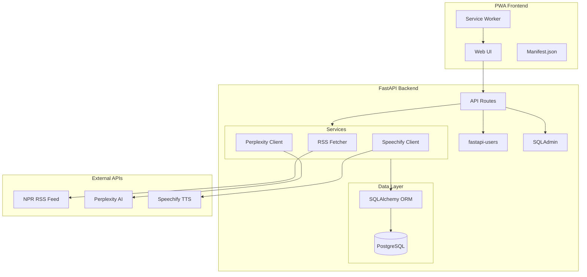

# NPR News Summarizer - System Architecture

## Overview
A Progressive Web App (PWA) that fetches NPR news, summarizes articles using Perplexity AI, and reads them aloud using Speechify TTS.

## System Architecture Diagram

## Component Details

### Backend (FastAPI)
- **Framework**: FastAPI with uvicorn
- **Authentication**: fastapi-users with JWT
- **Database**: PostgreSQL with SQLAlchemy ORM
- **Admin**: SQLAdmin for database management
- **Port**: 8000

### Frontend (PWA)
- **Type**: Vanilla JavaScript/HTML/CSS
- **Features**: Service Worker, Manifest, Responsive Design
- **Capabilities**: Installable on mobile, offline support

### External APIs
- **NPR RSS**: `https://feeds.npr.org/1002/rss.xml`
- **Perplexity AI**: Article summarization
- **Speechify**: Text-to-speech conversion

## Data Flow

1. User opens PWA → sees cached/latest 20 NPR articles (sorted newest first)
2. User clicks "Refresh" → backend fetches fresh RSS feed
3. User selects article → backend checks cache for summary
4. If no summary → call Perplexity AI → cache result
5. User clicks "Listen" → call Speechify TTS → play audio
6. Article marked as "read" in database

## Key Features

### RSS Feed Management
- Fetch max 20 articles from NPR feed
- Sort by publication date (newest first)
- Manual refresh button
- Auto-refresh every 10 minutes (background task)

### Caching Strategy
- Articles cached in database
- Summaries cached to save Perplexity tokens
- User read history tracked

### Authentication
- Open registration
- JWT-based authentication
- Protected endpoints for personalized features
