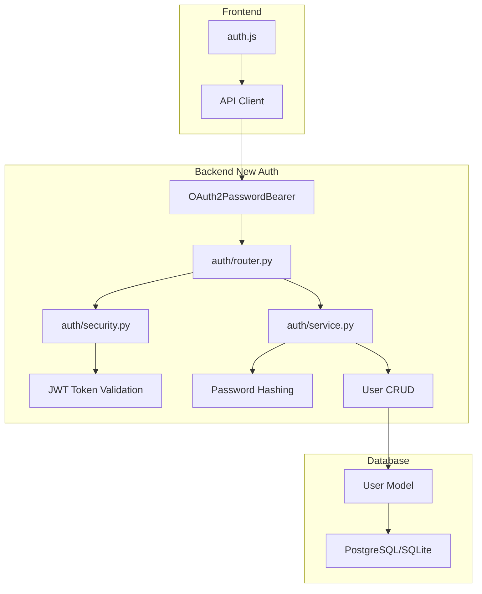

# Migration Plan: Replace fastapi-users with Built-in FastAPI Auth

## Overview

This plan outlines the steps to replace the `fastapi-users` library with FastAPI's built-in authentication utilities (OAuth2 with JWT tokens). This will simplify the codebase and resolve compatibility issues.

## Current Implementation Analysis

### Files Using fastapi-users

| File | Usage |
|------|-------|
| [`backend/app/database.py`](../backend/app/database.py) | `SQLAlchemyBaseUserTableUUID`, `SQLAlchemyUserDatabase` |
| [`backend/app/main.py`](../backend/app/main.py) | `FastAPIUsers`, `AuthenticationBackend`, `BearerTransport`, `JWTStrategy`, user schemas |
| [`backend/requirements.txt`](../backend/requirements.txt) | `fastapi-users[sqlalchemy]==14.0.0` |

### Current Auth Endpoints

| Endpoint | Method | Description |
|----------|--------|-------------|
| `/auth/jwt/login` | POST | Login with form data (username/password) |
| `/auth/jwt/logout` | POST | Logout current user |
| `/auth/register` | POST | Register new user |
| `/auth/forgot-password` | POST | Request password reset |
| `/auth/reset-password` | POST | Reset password with token |
| `/auth/verify` | POST | Verify email |
| `/auth/users/{id}` | GET/PATCH | User management |
| `/auth/me` | GET | Get current user (frontend expects this) |

### Current User Model Fields

From `SQLAlchemyBaseUserTableUUID`:
- `id` (UUID)
- `email` (string, unique)
- `hashed_password` (string)
- `is_active` (boolean)
- `is_superuser` (boolean)
- `is_verified` (boolean)

---

## Migration Architecture



---

## Implementation Steps

### Step 1: Update Dependencies

**File:** [`backend/requirements.txt`](../backend/requirements.txt)

Remove:
```
fastapi-users[sqlalchemy]==14.0.0
```

Add:
```
python-jose[cryptography]>=3.3.0
passlib[bcrypt]>=1.7.4
```

### Step 2: Create New User Model

**File:** [`backend/app/models/user.py`](../backend/app/models/user.py) (new file)

Create a custom User model that replaces `SQLAlchemyBaseUserTableUUID`:

```python
class User(Base):
    __tablename__ = "user"
    
    id: Mapped[uuid.UUID] = mapped_column(primary_key=True, default=uuid.uuid4)
    email: Mapped[str] = mapped_column(String, unique=True, index=True)
    hashed_password: Mapped[str] = mapped_column(String)
    is_active: Mapped[bool] = mapped_column(Boolean, default=True)
    is_superuser: Mapped[bool] = mapped_column(Boolean, default=False)
    is_verified: Mapped[bool] = mapped_column(Boolean, default=False)
    
    # Relationships
    user_articles = relationship("UserArticle", back_populates="user", cascade="all, delete-orphan")
```

### Step 3: Create Auth Module

Create a new `backend/app/auth/` directory with the following files:

#### 3.1: [`backend/app/auth/__init__.py`](../backend/app/auth/__init__.py)
Export main auth components.

#### 3.2: [`backend/app/auth/security.py`](../backend/app/auth/security.py)
Password hashing and JWT token utilities:

```python
# Functions to implement:
- verify_password(plain_password: str, hashed_password: str) -> bool
- get_password_hash(password: str) -> str
- create_access_token(data: dict, expires_delta: timedelta | None = None) -> str
- decode_token(token: str) -> dict | None
```

#### 3.3: [`backend/app/auth/service.py`](../backend/app/auth/service.py)
User authentication service:

```python
# Functions to implement:
- authenticate_user(session: AsyncSession, email: str, password: str) -> User | None
- get_user_by_email(session: AsyncSession, email: str) -> User | None
- create_user(session: AsyncSession, email: str, password: str) -> User
- get_current_user(token: str, session: AsyncSession) -> User
```

#### 3.4: [`backend/app/auth/router.py`](../backend/app/auth/router.py)
Auth endpoints matching current API:

```python
# Endpoints to implement:
- POST /auth/jwt/login - OAuth2 compatible login
- POST /auth/jwt/logout - Logout (optional, mainly client-side)
- POST /auth/register - Create new user
- GET /auth/me - Get current user info
```

### Step 4: Update Database Module

**File:** [`backend/app/database.py`](../backend/app/database.py)

- Remove `SQLAlchemyBaseUserTableUUID` and `SQLAlchemyUserDatabase` imports
- Remove `get_user_db` function (no longer needed)
- Import User from `app.models.user`

### Step 5: Update Main Application

**File:** [`backend/app/main.py`](../backend/app/main.py)

Remove:
- All fastapi-users imports
- `UserRead`, `UserCreate`, `UserUpdate` schema definitions
- `bearer_transport`, `get_jwt_strategy`, `auth_backend`, `fastapi_users` setup
- `current_active_user`, `current_superuser` definitions
- All `fastapi_users.get_*_router()` includes

Add:
- Import auth router from `app.auth.router`
- Include auth router with prefix `/auth`
- Create `get_current_user` dependency using `OAuth2PasswordBearer`

### Step 6: Update Schemas

**File:** [`backend/app/schemas/user.py`](../backend/app/schemas/user.py)

The existing schemas should work with minor adjustments:
- `UserRead` - Already defined correctly
- `UserCreate` - Already defined correctly  
- `UserUpdate` - Already defined correctly

Add `Token` schema for login response:
```python
class Token(BaseModel):
    access_token: str
    token_type: str = "bearer"
```

### Step 7: Update Routers

**File:** [`backend/app/routers/articles.py`](../backend/app/routers/articles.py)

Update the `user_id` parameter injection to use the new auth dependency:

```python
from app.auth import get_current_user

@router.get("")
async def list_articles(
    session: AsyncSession = Depends(get_async_session),
    current_user: User = Depends(get_current_user)  # Optional: make optional with None default
):
    user_id = current_user.id if current_user else None
    # ... rest of code
```

### Step 8: Frontend Compatibility

**File:** [`frontend/js/api.js`](../frontend/js/api.js)

The frontend should work without changes since we're maintaining the same API endpoints:
- `/auth/jwt/login` - Same endpoint
- `/auth/register` - Same endpoint
- `/auth/me` - New endpoint (was using fastapi-users users router)

---

## File Changes Summary

| File | Action | Description |
|------|--------|-------------|
| `backend/requirements.txt` | Modify | Remove fastapi-users, add python-jose, passlib |
| `backend/app/models/user.py` | Create | New User model |
| `backend/app/auth/__init__.py` | Create | Auth module init |
| `backend/app/auth/security.py` | Create | Password and JWT utilities |
| `backend/app/auth/service.py` | Create | User auth service |
| `backend/app/auth/router.py` | Create | Auth endpoints |
| `backend/app/database.py` | Modify | Remove fastapi-users dependencies |
| `backend/app/main.py` | Modify | Use new auth system |
| `backend/app/schemas/user.py` | Modify | Add Token schema |
| `backend/app/routers/articles.py` | Modify | Use new auth dependency |
| `backend/app/admin/admin.py` | Verify | Should work with new User model |

---

## API Endpoint Mapping

| Old Endpoint | New Endpoint | Notes |
|--------------|--------------|-------|
| `POST /auth/jwt/login` | `POST /auth/jwt/login` | Same - OAuth2 form login |
| `POST /auth/jwt/logout` | `POST /auth/jwt/logout` | Client-side token removal |
| `POST /auth/register` | `POST /auth/register` | Same - User registration |
| `GET /auth/users/me` | `GET /auth/me` | Simplified path |
| `POST /auth/forgot-password` | - | Not implemented (can add later) |
| `POST /auth/reset-password` | - | Not implemented (can add later) |
| `POST /auth/verify` | - | Not implemented (can add later) |

---

## Security Configuration

The following settings from [`backend/app/config.py`](../backend/app/config.py) will be used:

```python
secret_key: str = "change-me-in-production"  # JWT signing key
# Add these optional settings:
access_token_expire_minutes: int = 60  # Token lifetime
```

---

## Testing Checklist

After implementation, verify:

- [ ] User registration works
- [ ] Login returns valid JWT token
- [ ] Token can be used to access protected endpoints
- [ ] `/auth/me` returns current user info
- [ ] Article read/favorite status works with authenticated user
- [ ] Admin panel still works with User model
- [ ] Token expiration is handled correctly
- [ ] Invalid tokens are rejected with 401

---

## Migration Notes

1. **Database Migration**: The new User model should be compatible with existing data since we're using the same table name and columns. However, you may want to create an Alembic migration to be safe.

2. **Existing Tokens**: After migration, existing JWT tokens will still work if the `secret_key` remains the same.

3. **Password Hashing**: The new implementation uses bcrypt (via passlib), which should be compatible with passwords hashed by fastapi-users.

4. **Optional Features**: Password reset and email verification are not included in the initial migration but can be added later.
