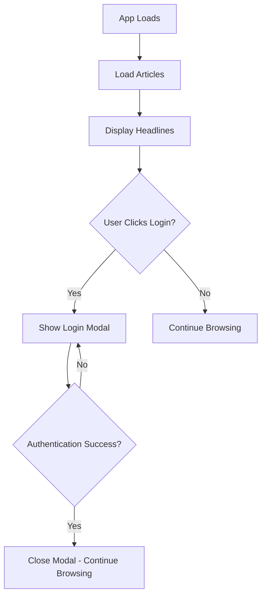
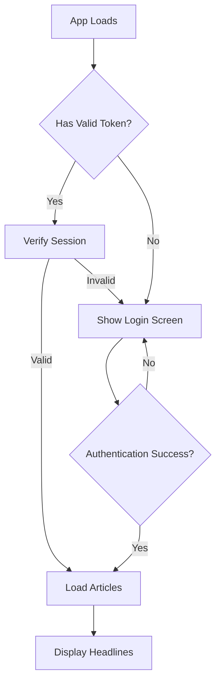

# Authentication-Required Flow Plan

## Overview

Change the application flow so that users must be authenticated before accessing any content. The login screen should be the first thing users see, and headlines should only be displayed after successful authentication.

## Current Flow

## New Flow

## Implementation Details

### Phase 1: Frontend Changes

#### 1.1 Add Login Screen Overlay
Add a full-screen login overlay that covers the entire application until the user is authenticated.

**File: `frontend/index.html`**
- Add a new `
` element that contains the login/register form
- This will be a full-screen overlay, not a modal
- Hide the main content (header, articles) until authenticated

#### 1.2 Update App Initialization
**File: `frontend/js/app.js`**
- Modify `App.init()` to check authentication status before loading articles
- Only call `loadArticles()` after successful authentication
- Add method to handle authentication state changes

#### 1.3 Update Auth Manager
**File: `frontend/js/auth.js`**
- Add logic to show/hide the login screen based on authentication state
- On successful login: hide login screen, load articles
- On logout: show login screen, clear articles

#### 1.4 Add CSS Styles
**File: `frontend/css/styles.css`**
- Add styles for the full-screen login overlay
- Ensure it covers the entire viewport
- Style the login form centered on the screen

### Phase 2: Backend Changes (Optional)

#### 2.1 Protect Article Endpoints
**File: `backend/app/routers/articles.py`**
- Consider adding authentication requirement to article endpoints
- This is optional since the frontend already enforces authentication

## File Changes Summary

### Modified Files
| File | Changes |
|------|---------|
| `frontend/index.html` | Add full-screen login overlay, hide main content by default |
| `frontend/js/app.js` | Check auth before loading articles, add auth state handler |
| `frontend/js/auth.js` | Show/hide login screen, trigger article load on login |
| `frontend/css/styles.css` | Add styles for login screen overlay |

## UI/UX Considerations

1. **First-time Users**: Will see the login screen with option to register
2. **Returning Users with Valid Session**: Will briefly see login screen while session is verified, then see headlines
3. **Session Expired**: Will be returned to login screen with a message
4. **Logout**: Will return to login screen

## Implementation Order

1. Add login screen HTML structure
2. Add CSS styles for login screen
3. Update auth.js to show/hide login screen
4. Update app.js to wait for authentication before loading articles
5. Test the complete flow

## Decisions Made

1. **Backend Protection**: Yes - backend article endpoints will also require authentication
2. **Session Check Loading State**: No - don't show loading state, just check and proceed
3. **Register Form**: Keep current toggle behavior within login screen
