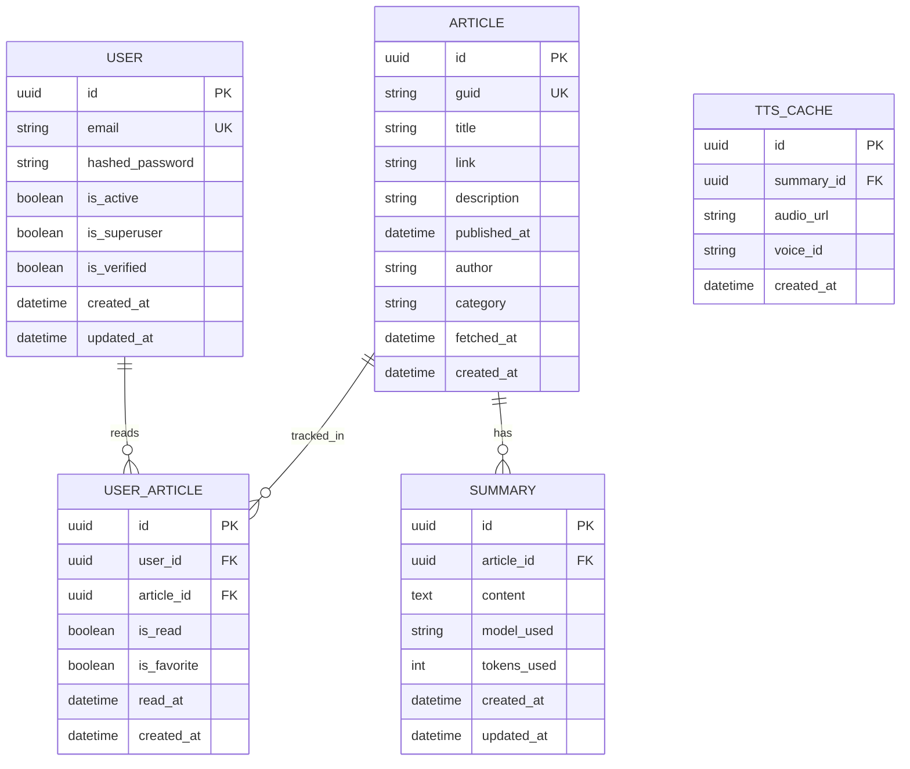

# Database Schema

## Entity Relationship Diagram



## Table Definitions

### User (fastapi-users managed)
Managed by `fastapi-users` library with SQLAlchemy adapter.

| Column | Type | Constraints | Description |
|--------|------|-------------|-------------|
| id | UUID | PK | User identifier |
| email | String | UK, Not Null | User email (login) |
| hashed_password | String | Not Null | Bcrypt hashed password |
| is_active | Boolean | Default True | Account active status |
| is_superuser | Boolean | Default False | Admin privileges |
| is_verified | Boolean | Default False | Email verified |
| created_at | DateTime | Default now | Account creation |
| updated_at | DateTime | Auto update | Last update |

### Article
Cached NPR articles from RSS feed.

| Column | Type | Constraints | Description |
|--------|------|-------------|-------------|
| id | UUID | PK | Article identifier |
| guid | String | UK, Not Null | RSS GUID (unique) |
| title | String | Not Null | Article title |
| link | String | Not Null | Original URL |
| description | Text | Nullable | Article excerpt |
| published_at | DateTime | Not Null | Original pub date |
| author | String | Nullable | Article author |
| category | String | Nullable | News category |
| fetched_at | DateTime | Default now | When we fetched it |
| created_at | DateTime | Default now | Record creation |

### Summary
Cached AI summaries to save API tokens.

| Column | Type | Constraints | Description |
|--------|------|-------------|-------------|
| id | UUID | PK | Summary identifier |
| article_id | UUID | FK → Article | Linked article |
| content | Text | Not Null | Summary text |
| model_used | String | Default | Perplexity model |
| tokens_used | Integer | Nullable | API usage tracking |
| created_at | DateTime | Default now | When generated |
| updated_at | DateTime | Auto update | Last regeneration |

### UserArticle
Tracks user interactions with articles.

| Column | Type | Constraints | Description |
|--------|------|-------------|-------------|
| id | UUID | PK | Record identifier |
| user_id | UUID | FK → User | Which user |
| article_id | UUID | FK → Article | Which article |
| is_read | Boolean | Default False | Has been read |
| is_favorite | Boolean | Default False | Bookmarked |
| read_at | DateTime | Nullable | When read |
| created_at | DateTime | Default now | First seen |

### TTS_Cache (Optional)
Cache TTS audio URLs to avoid regenerating.

| Column | Type | Constraints | Description |
|--------|------|-------------|-------------|
| id | UUID | PK | Cache identifier |
| summary_id | UUID | FK → Summary | Linked summary |
| audio_url | String | Not Null | Speechify audio URL |
| voice_id | String | Default | Voice used |
| created_at | DateTime | Default now | When generated |

## Indexes

```sql
-- Fast lookups
CREATE INDEX idx_article_published_at ON article(published_at DESC);
CREATE INDEX idx_article_guid ON article(guid);
CREATE INDEX idx_user_article_user_id ON user_article(user_id);
CREATE INDEX idx_user_article_article_id ON user_article(article_id);
CREATE INDEX idx_summary_article_id ON summary(article_id);
```

## Data Retention

- Keep latest 100 articles (auto-cleanup old ones)
- Summaries kept indefinitely (small text, saves tokens)
- User read history kept indefinitely
