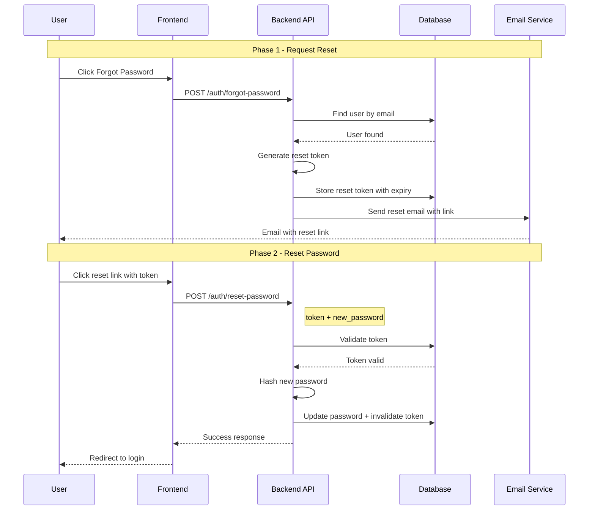

# Password Reset Implementation Plan

## Overview

This plan outlines the implementation of a password reset feature for the NPR News Summarizer application. The feature will allow users to request a password reset via email and set a new password using a secure token.

## Architecture



---

## Backend Implementation

### 1. Database Changes

**File:** [`backend/app/models/password_reset.py`](../backend/app/models/password_reset.py) (new file)

Create a `PasswordReset` model to store reset tokens:

| Field | Type | Description |
|-------|------|-------------|
| `id` | UUID | Primary key |
| `user_id` | UUID | Foreign key to User |
| `token` | String(255) | Hashed reset token |
| `created_at` | DateTime | Token creation time |
| `expires_at` | DateTime | Token expiration time |
| `used_at` | DateTime (nullable) | When token was used |

**Relationships:**
- `PasswordReset.user` → Many-to-one to User
- `User.password_resets` → One-to-many to PasswordReset

### 2. Email Service

**File:** [`backend/app/services/email.py`](../backend/app/services/email.py) (new file)

Create an email service for sending reset emails:

```python
# Functions:
- send_password_reset_email(email: str, reset_token: str, reset_url: str) -> bool
```

**Configuration additions** (in [`backend/app/config.py`](../backend/app/config.py)):
- `smtp_host` - SMTP server hostname
- `smtp_port` - SMTP server port
- `smtp_user` - SMTP username
- `smtp_password` - SMTP password
- `smtp_from_email` - Sender email address
- `frontend_url` - Frontend base URL for reset links

**Email Template:**
```
Subject: Password Reset Request

Hello,

You have requested to reset your password. Click the link below to proceed:

{reset_url}?token={token}

This link will expire in 1 hour.

If you did not request this reset, please ignore this email.
```

### 3. Auth Router Updates

**File:** [`backend/app/auth/router.py`](../backend/app/auth/router.py) (modify)

Add two new endpoints:

#### POST /auth/forgot-password
- **Input:** `{ "email": "user@example.com" }`
- **Behavior:**
  1. Find user by email
  2. If user exists, generate a secure random token
  3. Store hashed token in database with 1-hour expiry
  4. Send email with reset link
  5. Always return success (don't reveal if email exists)
- **Response:** `{ "message": "If the email exists, a reset link has been sent" }`

#### POST /auth/reset-password
- **Input:** `{ "token": "abc123...", "password": "newPassword123" }`
- **Behavior:**
  1. Validate token (exists, not expired, not used)
  2. Hash new password
  3. Update user's password
  4. Mark token as used
  5. Optionally: Invalidate all existing auth tokens
- **Response:** `{ "message": "Password has been reset successfully" }`

### 4. Schemas

**File:** [`backend/app/schemas/user.py`](../backend/app/schemas/user.py) (modify)

Add new schemas:

```python
class ForgotPasswordRequest(BaseModel):
    email: EmailStr

class ResetPasswordRequest(BaseModel):
    token: str
    password: str  # New password
```

---

## Frontend Implementation

### 1. API Client Updates

**File:** [`frontend/js/api.js`](../frontend/js/api.js) (modify)

Add new methods:

```javascript
async forgotPassword(email) {
    return this.request('/auth/forgot-password', {
        method: 'POST',
        body: JSON.stringify({ email })
    });
}

async resetPassword(token, password) {
    return this.request('/auth/reset-password', {
        method: 'POST',
        body: JSON.stringify({ token, password })
    });
}
```

### 2. UI Components

**File:** [`frontend/index.html`](../frontend/index.html) (modify)

Add a "Forgot Password" modal with two states:

#### State 1: Request Reset
- Email input field
- Submit button
- Link back to login

#### State 2: Reset Password
- New password input
- Confirm password input
- Submit button

**File:** [`frontend/js/auth.js`](../frontend/js/auth.js) (modify)

Add handlers for:
- Opening forgot password modal
- Submitting forgot password form
- Handling reset password page (with token from URL)
- Submitting new password

### 3. Password Reset Page

**Option A: Modal-based (simpler)**
- Add a "Forgot Password?" link in the login modal
- Opens a forgot password modal
- After submitting email, show success message
- User clicks link in email, which opens the app with `?reset_token=...`
- App detects token and shows reset password modal

**Option B: Dedicated page (recommended)**
- Create a separate reset password view
- URL: `/reset-password.html?token=...`
- Cleaner separation of concerns

---

## Security Considerations

1. **Token Generation:** Use `secrets.token_urlsafe(32)` for cryptographically secure tokens
2. **Token Storage:** Store only the hashed token in the database (like passwords)
3. **Token Expiry:** 1 hour maximum, configurable
4. **Rate Limiting:** Limit password reset requests per email (e.g., 3 per hour)
5. **Token Invalidation:** Mark tokens as used after successful password reset
6. **User Notification:** Optionally notify user via email when password is changed
7. **HTTPS Required:** Password reset links must only work over HTTPS

---

## File Changes Summary

| File | Action | Description |
|------|--------|-------------|
| `backend/app/models/password_reset.py` | Create | PasswordReset model |
| `backend/app/models/user.py` | Modify | Add password_resets relationship |
| `backend/app/models/__init__.py` | Modify | Export PasswordReset |
| `backend/app/services/email.py` | Create | Email sending service |
| `backend/app/auth/router.py` | Modify | Add forgot/reset endpoints |
| `backend/app/schemas/user.py` | Modify | Add request schemas |
| `backend/app/config.py` | Modify | Add SMTP settings |
| `frontend/js/api.js` | Modify | Add API methods |
| `frontend/index.html` | Modify | Add reset modal/page |
| `frontend/js/auth.js` | Modify | Add reset handlers |
| `frontend/css/styles.css` | Modify | Style reset components |

---

## Email Service Options

### Option 1: SMTP (Recommended for production)
- Use any SMTP provider (Gmail, SendGrid, AWS SES, etc.)
- Most flexible and widely supported

### Option 2: Console Logging (Development only)
- Log reset tokens to console instead of sending email
- Useful for testing without email setup

### Option 3: File-based (Development)
- Write reset tokens to a file
- Can be checked during development

---

## Implementation Order

1. Create PasswordReset model
2. Add email service (with console fallback for development)
3. Add forgot-password endpoint
4. Add reset-password endpoint
5. Update frontend API client
6. Add forgot password UI to login modal
7. Add reset password page/modal
8. Test complete flow

---

## Testing Checklist

- [ ] Request reset with valid email sends email
- [ ] Request reset with invalid email returns success (security)
- [ ] Reset with valid token updates password
- [ ] Reset with expired token fails
- [ ] Reset with used token fails
- [ ] Can login with new password after reset
- [ ] Cannot login with old password after reset
- [ ] Frontend shows appropriate success/error messages
