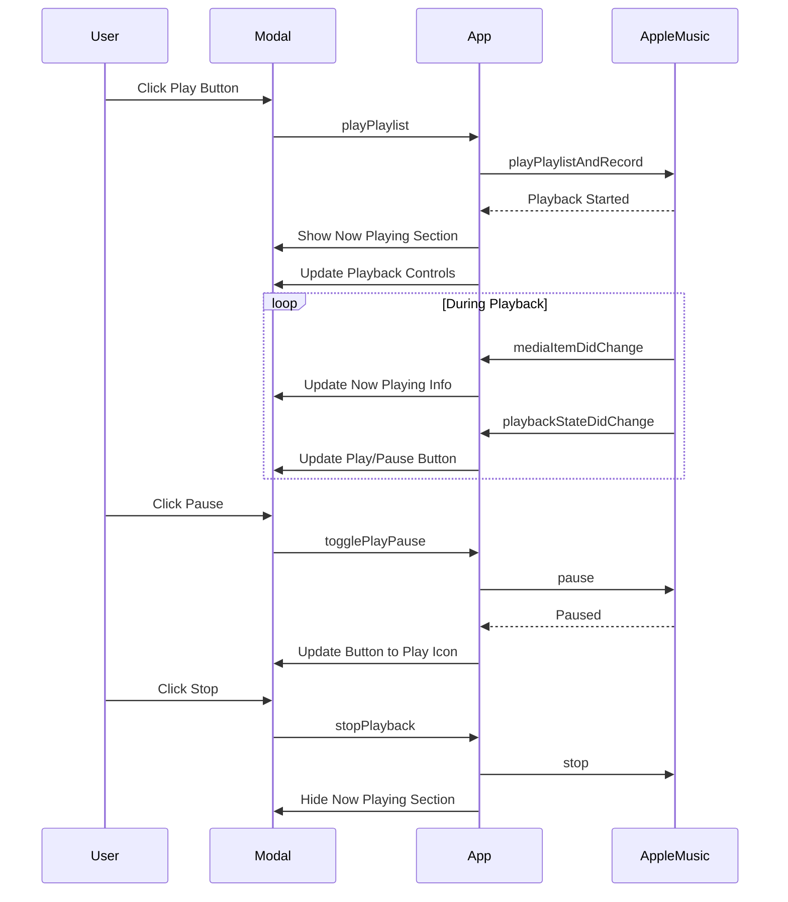

# Playlist Playback Controls Plan

## Problem Statement

After hitting play in the radio card, a modal displays the generated playlist. When the user clicks "Play with Apple Music", the app resolves the playlist, checks authentication, starts playing music, and then **closes the modal**. Once closed, the user has no way to:
- Stop/pause the music
- Skip to next/previous tracks
- See what is currently playing

## Current Implementation Analysis

### Key Files:
- [`frontend/js/app.js`](frontend/js/app.js) - Main application logic, contains `playPlaylist()` method
- [`frontend/js/appleMusic.js`](frontend/js/appleMusic.js) - Apple Music service wrapper
- [`frontend/index.html`](frontend/index.html) - Contains the playlist modal HTML structure
- [`frontend/css/styles.css`](frontend/css/styles.css) - Styling

### Current Flow:
1. User clicks play button on station card → [`generatePlaylist()`](frontend/js/app.js:306)
2. Playlist generated via Perplexity API
3. [`displayPlaylistModal()`](frontend/js/app.js:328) shows modal with songs
4. User clicks "Play with Apple Music" → [`playPlaylist()`](frontend/js/app.js:563)
5. After playback starts, **modal closes** (line 664 in app.js)

### The Issue:
```javascript
// In playPlaylist() - line 664
this.playlistModal.close();  // <-- This closes the modal!
```

## Proposed Solution

### 1. Keep Modal Open After Playback Starts

**Change:** Remove the `this.playlistModal.close()` call from [`playPlaylist()`](frontend/js/app.js:664)

### 2. Add Playback Controls to Modal

Add a new "Now Playing" section in the playlist modal with:
- Current song display (title, artist, album art)
- Playback controls (Play/Pause, Stop, Next, Previous)
- Progress indicator

### 3. UI Changes

#### HTML Structure Changes to [`frontend/index.html`](frontend/index.html)

Add a "Now Playing" section inside the playlist modal:

```html
<!-- Now Playing Section -->
<div id="now-playing-section" class="now-playing-section hidden">
    <div class="now-playing-info">
        <div class="now-playing-artwork">
            
        </div>
        <div class="now-playing-details">
            <div id="now-playing-title" class="now-playing-title"></div>
            <div id="now-playing-artist" class="now-playing-artist"></div>
        </div>
    </div>
    <div class="playback-controls">
        <button id="btn-prev" class="btn btn-icon" title="Previous">⏮️</button>
        <button id="btn-play-pause" class="btn btn-primary" title="Play/Pause">⏸️</button>
        <button id="btn-next" class="btn btn-icon" title="Next">⏭️</button>
        <button id="btn-stop" class="btn btn-secondary" title="Stop">⏹️</button>
    </div>
</div>
```

#### CSS Additions to [`frontend/css/styles.css`](frontend/css/styles.css)

```css
/* Now Playing Section */
.now-playing-section {
    background: linear-gradient(135deg, var(--primary-color), var(--primary-light));
    color: white;
    padding: 1rem;
    border-radius: var(--radius);
    margin-bottom: 1rem;
}

.now-playing-info {
    display: flex;
    align-items: center;
    gap: 1rem;
    margin-bottom: 1rem;
}

.now-playing-artwork {
    width: 60px;
    height: 60px;
    border-radius: var(--radius);
    overflow: hidden;
    background: var(--secondary-color);
}

.now-playing-artwork img {
    width: 100%;
    height: 100%;
    object-fit: cover;
}

.now-playing-title {
    font-weight: 600;
    font-size: 1rem;
}

.now-playing-artist {
    font-size: 0.875rem;
    opacity: 0.9;
}

.playback-controls {
    display: flex;
    justify-content: center;
    gap: 0.5rem;
}

.playback-controls .btn {
    min-width: 44px;
}
```

### 4. JavaScript Changes

#### Changes to [`frontend/js/appleMusic.js`](frontend/js/appleMusic.js)

Add callback support for playback state changes:

```javascript
// Add to _setupEventListeners()
this.music.addEventListener('playbackStateDidChange', (event) => {
    console.log('AppleMusic: playbackStateDidChange', event?.state);
    if (this._onPlaybackStateChange) {
        this._onPlaybackStateChange(event);
    }
});

this.music.addEventListener('mediaItemDidChange', (event) => {
    console.log('AppleMusic: mediaItemDidChange');
    if (this._onMediaItemChange) {
        this._onMediaItemChange(event);
    }
});

// Add methods to set callbacks
onPlaybackStateChange(callback) {
    this._onPlaybackStateChange = callback;
}

onMediaItemChange(callback) {
    this._onMediaItemChange = callback;
}

// Add stop method
async stop() {
    if (this.music) {
        await this.music.stop();
    }
}

// Add toggle play/pause
async togglePlayPause() {
    if (!this.music) return;
    
    if (this.music.playbackState === MusicKit.PlaybackStates.playing) {
        await this.music.pause();
    } else {
        await this.music.play();
    }
}

// Check if currently playing
isPlaying() {
    if (!this.music) return false;
    return this.music.playbackState === MusicKit.PlaybackStates.playing;
}
```

#### Changes to [`frontend/js/app.js`](frontend/js/app.js)

1. **Remove modal close from `playPlaylist()`** (line 664)

2. **Add new methods for playback control:**

```javascript
setupPlaybackControls() {
    // Play/Pause button
    const playPauseBtn = document.getElementById('btn-play-pause');
    if (playPauseBtn) {
        playPauseBtn.addEventListener('click', () => this.togglePlayPause());
    }
    
    // Stop button
    const stopBtn = document.getElementById('btn-stop');
    if (stopBtn) {
        stopBtn.addEventListener('click', () => this.stopPlayback());
    }
    
    // Next button
    const nextBtn = document.getElementById('btn-next');
    if (nextBtn) {
        nextBtn.addEventListener('click', () => this.skipToNext());
    }
    
    // Previous button
    const prevBtn = document.getElementById('btn-prev');
    if (prevBtn) {
        prevBtn.addEventListener('click', () => this.skipToPrevious());
    }
    
    // Set up Apple Music callbacks
    appleMusic.onPlaybackStateChange((event) => this.handlePlaybackStateChange(event));
    appleMusic.onMediaItemChange((event) => this.handleMediaItemChange(event));
}

togglePlayPause() {
    appleMusic.togglePlayPause();
}

stopPlayback() {
    appleMusic.stop();
    this.hideNowPlaying();
}

skipToNext() {
    appleMusic.skipToNext();
}

skipToPrevious() {
    appleMusic.skipToPrevious();
}

handlePlaybackStateChange(event) {
    const playPauseBtn = document.getElementById('btn-play-pause');
    if (!playPauseBtn) return;
    
    if (appleMusic.isPlaying()) {
        playPauseBtn.innerHTML = '⏸️';
    } else {
        playPauseBtn.innerHTML = '▶️';
    }
}

handleMediaItemChange(event) {
    const currentSong = appleMusic.getCurrentSong();
    if (currentSong) {
        this.updateNowPlaying(currentSong);
    }
}

updateNowPlaying(song) {
    const section = document.getElementById('now-playing-section');
    const titleEl = document.getElementById('now-playing-title');
    const artistEl = document.getElementById('now-playing-artist');
    const artworkEl = document.getElementById('now-playing-artwork');
    
    if (section && titleEl && artistEl) {
        titleEl.textContent = song.title || 'Unknown';
        artistEl.textContent = song.artist || 'Unknown Artist';
        
        // Get artwork URL
        if (song.artwork && artworkEl) {
            artworkEl.src = song.artwork.replace('{w}', '120').replace('{h}', '120');
        }
        
        section.classList.remove('hidden');
    }
}

hideNowPlaying() {
    const section = document.getElementById('now-playing-section');
    if (section) {
        section.classList.add('hidden');
    }
}
```

3. **Update `displayPlaylistModal()` to set up playback controls:**

```javascript
displayPlaylistModal(playlist) {
    // ... existing code ...
    
    // Set up playback controls
    this.setupPlaybackControls();
    
    // Hide now playing section initially
    this.hideNowPlaying();
    
    this.playlistModal.open();
}
```

4. **Update `playPlaylist()` to show now playing after playback starts:**

```javascript
async playPlaylist() {
    // ... existing code ...
    
    try {
        // ... playback code ...
        
        this.updatePlaylistStatus('Playing! 🎵', 'success');
        showToast('Playing playlist!', 'success');
        
        // Show now playing section
        const currentSong = appleMusic.getCurrentSong();
        if (currentSong) {
            this.updateNowPlaying(currentSong);
        }
        
        // DON'T close modal - removed this line
        // this.playlistModal.close();
        
    } catch (error) {
        // ... error handling ...
    }
}
```

## Implementation Flow Diagram



## Files to Modify

| File | Changes |
|------|---------|
| [`frontend/js/app.js`](frontend/js/app.js) | Remove modal close, add playback control methods, add now playing UI updates |
| [`frontend/js/appleMusic.js`](frontend/js/appleMusic.js) | Add callback system, stop method, togglePlayPause, isPlaying |
| [`frontend/index.html`](frontend/index.html) | Add Now Playing section HTML to playlist modal |
| [`frontend/css/styles.css`](frontend/css/styles.css) | Add styles for Now Playing section and playback controls |

## Testing Checklist

- [ ] Modal stays open after playback starts
- [ ] Now Playing section shows current song
- [ ] Play/Pause button toggles correctly
- [ ] Stop button stops playback and hides Now Playing
- [ ] Next/Previous buttons work
- [ ] UI updates when song changes
- [ ] UI updates when playback state changes
- [ ] Modal can still be closed manually via Close button
