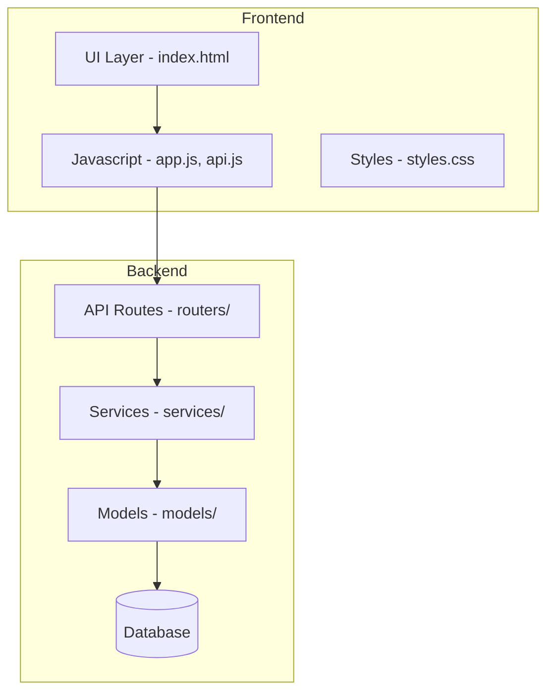

# Radio Station Feature Implementation Plan

## Overview
This plan outlines the implementation of a radio station feature that allows users to create personalized music stations based on their preferences.

## Architecture Overview



## Implementation Steps

### Phase 1: Database & Backend

#### 1.1 Create Station Model
- **File**: `backend/app/models/station.py`
- Create new `Station` model with fields:
  - `id` (UUID, primary key)
  - `user_id` (UUID, foreign key to user)
  - `name` (string, required)
  - `description` (text, optional)
  - `example_songs` (JSON array, optional)
  - `duration` (integer, 1-24 hours)
  - `image_url` (string, optional)
  - `created_at` (datetime)
  - `updated_at` (datetime)
- Add relationship to User model

#### 1.2 Create Station Schema
- **File**: `backend/app/schemas/station.py`
- Create Pydantic schemas:
  - `StationCreate` - for creating new stations
  - `StationUpdate` - for updating stations  
  - `StationRead` - for reading station data

#### 1.3 Create Station Router
- **File**: `backend/app/routers/stations.py`
- Implement CRUD endpoints:
  - `GET /api/stations` - List all stations for current user
  - `POST /api/stations` - Create a new station
  - `GET /api/stations/{id}` - Get single station
  - `PUT /api/stations/{id}` - Update station
  - `DELETE /api/stations/{id}` - Delete station

#### 1.4 Register Router in Main
- **File**: `backend/app/main.py`
- Add station router to the FastAPI app

### Phase 2: Frontend UI Updates

#### 2.1 Add Navigation Menu
- **File**: `frontend/index.html`
- Modify the header to include a navigation menu
- Add two menu items:
  - "News" - for news feed
  - "Radio" - for radio stations
- Use active state to highlight current selection

#### 2.2 Add Radio Stations Display Area
- **File**: `frontend/index.html`
- Add container for displaying stations in the main content area
- Add (+) button to create new station

#### 2.3 Create Station Modal
- **File**: `frontend/index.html`
- Add new modal for creating/editing stations with:
  - Header: "Create Radio Station"
  - Intro text: "Create your own radio station based on what music you like or what mood you are in"
  - Name input field (required)
  - Image upload button with preview display
  - Description textarea with (i) info icon and tooltip
  - Example songs textarea
  - Duration dropdown (1-24 hours)
  - Cancel and Save buttons

#### 2.4 Add Station Card Component
- **File**: `frontend/js/ui.js`
- Add `createStationCard()` function to render station cards
- Display: image, name, description highlight

#### 2.5 Update API Client
- **File**: `frontend/js/api.js`
- Add new methods:
  - `getStations()` - fetch all stations
  - `createStation(data)` - create new station
  - `updateStation(id, data)` - update station
  - `deleteStation(id)` - delete station

#### 2.6 Add Station Logic
- **File**: `frontend/js/app.js`
- Add functions:
  - `loadStations()` - load and display stations
  - `showCreateStationModal()` - show create form
  - `saveStation()` - save station data
  - `handleStationImageUpload()` - handle image selection and preview
  - `navigateToSection(section)` - handle navigation

#### 2.7 Add Styles
- **File**: `frontend/css/styles.css`
- Add styles for:
  - Navigation menu
  - Station cards
  - Station modal form
  - Info tooltip
  - Image preview

### Phase 3: Integration

#### 3.1 Wire Up Navigation
- Connect menu items to section switching
- Remember user's last selected section

#### 3.2 Handle Image Upload
- Convert selected image to base64 for storage
- Display preview immediately after selection
- Use default guitar icon if no image provided

#### 3.3 Default Image
- Set default image URL for stations without custom images
- Use a guitar icon SVG data URI

## File Changes Summary

### New Files to Create
| File | Description |
|------|-------------|
| `backend/app/models/station.py` | Station SQLAlchemy model |
| `backend/app/schemas/station.py` | Station Pydantic schemas |
| `backend/app/routers/stations.py` | Station API endpoints |

### Files to Modify
| File | Changes |
|------|---------|
| `backend/app/models/__init__.py` | Export Station model |
| `backend/app/models/user.py` | Add stations relationship |
| `backend/app/main.py` | Include stations router |
| `frontend/index.html` | Add nav menu, station container, station modal |
| `frontend/js/api.js` | Add station API methods |
| `frontend/js/ui.js` | Add station card component |
| `frontend/js/app.js` | Add station logic |
| `frontend/css/styles.css` | Add station styles |

## API Endpoints

```
GET    /api/stations              - List all stations for user
POST   /api/stations              - Create new station
GET    /api/stations/{id}         - Get station by ID
PUT    /api/stations/{id}         - Update station
DELETE /api/stations/{id}         - Delete station
```

## Data Model

### Station Table
| Field | Type | Required | Description |
|-------|------|----------|-------------|
| id | UUID | Yes | Primary key |
| user_id | UUID | Yes | Foreign key to user |
| name | String(255) | Yes | Station name |
| description | Text | No | Music description |
| example_songs | JSON | No | Array of song examples |
| duration | Integer | Yes | Playlist duration (1-24) |
| image_url | String(500) | No | Station image URL |
| created_at | DateTime | Yes | Creation timestamp |
| updated_at | DateTime | Yes | Last update timestamp |

## Default Image
If user doesn't upload an image, use this default guitar icon:
```svg
data:image/svg+xml,<svg xmlns='http://www.w3.org/2000/svg' viewBox='0 0 100 100'><text y='.9em' font-size='90'>🎸</text></svg>
```

## UI Mockup

### Navigation Menu
```
┌─────────────────────────────────────┐
│ 📰 NPR News Summarizer    [⚙️] [🔔] │
│ [ News ] [ Radio ]                  │
├─────────────────────────────────────┤
│                                     │
│  ┌─────────┐  ┌─────────┐          │
│  │ 🎸      │  │ 🎸      │          │
│  │ Station1│  │ Station2│  [+]     │
│  │ Rock... │  │ Jazz... │          │
│  └─────────┘  └─────────┘          │
└─────────────────────────────────────┘
```

### Create Station Modal
```
┌─────────────────────────────────────┐
│ Create Radio Station           [X]  │
├─────────────────────────────────────┤
│ Create your own radio station      │
│ based on what music you like or     │
│ what mood you are in               │
│                                     │
│ Name *                              │
│ [________________________]          │
│                                     │
│ Station Image                       │
│ [Choose Image] [Preview]            │
│                                     │
│ Describe the music you like...  (i) │
│ [________________________]          │
│                                     │
│ Please provide 3-5 song examples   │
│ [________________________]          │
│                                     │
│ Duration                            │
│ [Select hours v]                   │
│                                     │
│        [Cancel]  [Save]             │
└─────────────────────────────────────┘
```

## Implementation Order

1. Create Station model and schema
2. Create Station router with CRUD endpoints
3. Update User model with station relationship
4. Register router in main.py
5. Add API methods in frontend
6. Add UI components (modal, container)
7. Add styles
8. Wire up navigation and station logic
9. Test the complete flow
