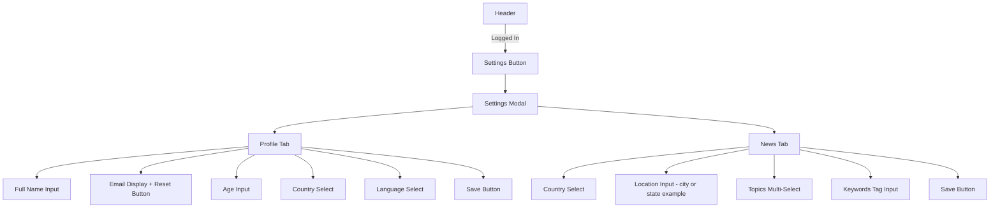

# Settings Menu Implementation Plan

## Overview

This plan outlines the implementation of a Settings Menu feature that allows logged-in users to manage their profile information and news preferences. The settings will be used to filter news articles based on user preferences.

## Feature Requirements

### Profile Settings
- Full Name
- Email (read-only, with password reset button next to it)
- Age
- Country
- Language

### News Preferences
- Country (for news source filtering)
- Location (city or state, e.g., "Atlanta", "Georgia")
- Topics (categories of interest - hardcoded list)
- Keywords (custom search terms)

---

## Architecture

### Database Schema

```mermaid
ERDiagram
    User ||--o| UserProfile : has
    User ||--o| UserPreferences : has
    
    User {
        uuid id PK
        string email
        string hashed_password
        boolean is_active
        boolean is_superuser
        boolean is_verified
    }
    
    UserProfile {
        uuid id PK
        uuid user_id FK
        string full_name
        integer age
        string country
        string language
        datetime created_at
        datetime updated_at
    }
    
    UserPreferences {
        uuid id PK
        uuid user_id FK
        string country
        string location
        json topics
        json keywords
        datetime created_at
        datetime updated_at
    }
```

### API Endpoints

| Method | Endpoint | Description |
|--------|----------|-------------|
| GET | `/api/settings/profile` | Get current user profile |
| PUT | `/api/settings/profile` | Update user profile |
| GET | `/api/settings/preferences` | Get news preferences |
| PUT | `/api/settings/preferences` | Update news preferences |

### Frontend Components



---

## Implementation Details

### Phase 1: Backend - Database Models

#### 1.1 Create UserProfile Model
File: `backend/app/models/user_profile.py`

```python
class UserProfile(Base):
    __tablename__ = "user_profile"
    
    id: Mapped[uuid.UUID] = mapped_column(primary_key=True, default=uuid.uuid4)
    user_id: Mapped[uuid.UUID] = mapped_column(ForeignKey("user.id"), unique=True)
    full_name: Mapped[Optional[str]] = mapped_column(String(255), nullable=True)
    age: Mapped[Optional[int]] = mapped_column(Integer, nullable=True)
    country: Mapped[Optional[str]] = mapped_column(String(100), nullable=True)
    language: Mapped[Optional[str]] = mapped_column(String(10), nullable=True)
    created_at: Mapped[datetime] = mapped_column(default=datetime.utcnow)
    updated_at: Mapped[datetime] = mapped_column(default=datetime.utcnow, onupdate=datetime.utcnow)
    
    user: Mapped["User"] = relationship("User", back_populates="profile")
```

#### 1.2 Create UserPreferences Model
File: `backend/app/models/user_preferences.py`

```python
class UserPreferences(Base):
    __tablename__ = "user_preferences"
    
    id: Mapped[uuid.UUID] = mapped_column(primary_key=True, default=uuid.uuid4)
    user_id: Mapped[uuid.UUID] = mapped_column(ForeignKey("user.id"), unique=True)
    country: Mapped[Optional[str]] = mapped_column(String(100), nullable=True)
    location: Mapped[Optional[str]] = mapped_column(String(255), nullable=True)
    topics: Mapped[Optional[list]] = mapped_column(JSON, nullable=True, default=list)
    keywords: Mapped[Optional[list]] = mapped_column(JSON, nullable=True, default=list)
    created_at: Mapped[datetime] = mapped_column(default=datetime.utcnow)
    updated_at: Mapped[datetime] = mapped_column(default=datetime.utcnow, onupdate=datetime.utcnow)
    
    user: Mapped["User"] = relationship("User", back_populates="preferences")
```

### Phase 2: Backend - Schemas

#### 2.1 Profile Schemas
File: `backend/app/schemas/settings.py`

```python
class ProfileUpdate(BaseModel):
    full_name: Optional[str] = None
    age: Optional[int] = None
    country: Optional[str] = None
    language: Optional[str] = None

class ProfileRead(BaseModel):
    full_name: Optional[str] = None
    age: Optional[int] = None
    country: Optional[str] = None
    language: Optional[str] = None
    email: EmailStr  # From User model
```

#### 2.2 Preferences Schemas

```python
class PreferencesUpdate(BaseModel):
    country: Optional[str] = None
    location: Optional[str] = None  # e.g., "Atlanta", "Georgia"
    topics: Optional[list[str]] = None
    keywords: Optional[list[str]] = None

class PreferencesRead(BaseModel):
    country: Optional[str] = None
    location: Optional[str] = None
    topics: list[str] = []
    keywords: list[str] = []
```

### Phase 3: Backend - Router

#### 3.1 Settings Router
File: `backend/app/routers/settings.py`

Endpoints:
- `GET /api/settings/profile` - Returns user profile with email
- `PUT /api/settings/profile` - Updates profile fields
- `GET /api/settings/preferences` - Returns news preferences
- `PUT /api/settings/preferences` - Updates preferences

**Note:** Password reset reuses the existing `/auth/forgot-password` endpoint. The frontend will call this endpoint when the user clicks the reset password button in the profile settings.

### Phase 4: Frontend - UI Components

#### 4.1 Settings Button in Header
- Add gear icon button next to auth button
- Only visible when user is authenticated
- Opens settings modal on click

#### 4.2 Settings Modal
- Tabbed interface with Profile and News tabs
- Responsive design matching existing modals
- Form validation and error handling

#### 4.3 Profile Tab
- Form fields for profile data
- Email field is read-only
- Reset Password button calls existing `/auth/forgot-password` endpoint
- Save button to update profile

#### 4.4 News Tab
- Country dropdown
- Location text input with placeholder example (e.g., "Atlanta" or "Georgia")
- Topics multi-select with predefined options
- Keywords tag input for custom terms
- Save button to update preferences

### Phase 5: API Integration

#### 5.1 API Client Updates
File: `frontend/js/api.js`

Add methods:
- `getProfile()`
- `updateProfile(data)`
- `getPreferences()`
- `updatePreferences(data)`

**Note:** Password reset uses existing `forgotPassword(email)` method.

---

## File Changes Summary

### New Files
| File | Description |
|------|-------------|
| `backend/app/models/user_profile.py` | UserProfile database model |
| `backend/app/models/user_preferences.py` | UserPreferences database model |
| `backend/app/schemas/settings.py` | Pydantic schemas for settings |
| `backend/app/routers/settings.py` | Settings API router |

### Modified Files
| File | Changes |
|------|---------|
| `backend/app/models/__init__.py` | Export new models |
| `backend/app/models/user.py` | Add relationships to profile and preferences |
| `backend/app/main.py` | Include settings router |
| `frontend/index.html` | Add settings modal HTML |
| `frontend/js/api.js` | Add settings API methods |
| `frontend/js/auth.js` | Add settings button visibility logic |
| `frontend/css/styles.css` | Add styles for settings components |

---

## Data Options

### Countries
Use ISO 3166-1 alpha-2 country codes with a predefined list of common countries.

### Languages
Use ISO 639-1 language codes: en, de, fr, es, etc.

### Topics (Predefined)
- Politics
- Technology
- Science
- Health
- Business
- Entertainment
- Sports
- Environment
- Education
- World News

### Location
Free-form text input allowing users to enter a city (e.g., "Atlanta") or state (e.g., "Georgia").

---

## Security Considerations

1. **Authentication Required**: All settings endpoints require valid JWT token
2. **User Isolation**: Users can only access their own profile and preferences
3. **Password Reset**: Reuses existing secure password reset flow with token expiration
4. **Input Validation**: All inputs validated with Pydantic schemas
5. **SQL Injection Prevention**: Using SQLAlchemy ORM with parameterized queries

---

## Decisions Made

1. **Location Format**: Free-form text input for city or state (e.g., "Atlanta", "Georgia")
2. **Topics Source**: Hardcoded list of common news topics
3. **News Filtering**: Will be implemented in a future feature, not part of this implementation
4. **Password Reset**: Reuses existing `/auth/forgot-password` endpoint - no new backend endpoint needed

---

## Implementation Order

1. Backend models and database schema
2. Backend schemas
3. Backend router and endpoints
4. Frontend API client methods
5. Frontend UI components
6. Integration testing
