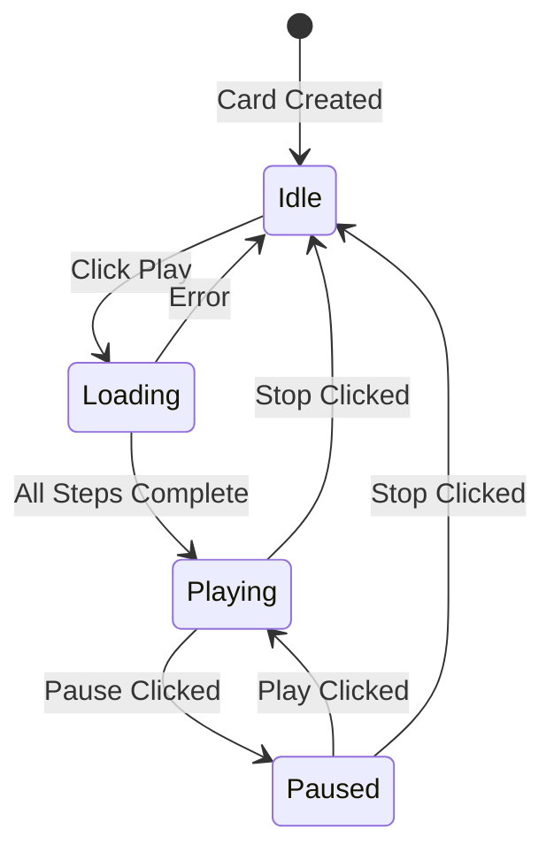

# Station Card Player Redesign Plan

## Overview

This plan outlines the redesign of the radio station card to embed the Apple Music player directly within the card, eliminating the need for a separate modal dialog.

## User Requirements

Based on user feedback:
- **No song list display** - The list of songs is not needed in the UI
- **No edit while playing** - Card is only editable when stopped (not playing or paused)
- **No minimize button** - Since everything is inside the card, no minimize needed

## Current Implementation Analysis

### Current Flow
1. User clicks play button on station card
2. `generatePlaylist(station)` is called → fetches playlist from Perplexity API
3. `displayPlaylistModal(playlist)` opens modal with:
   - Station info
   - Song list
   - Play/Resolve buttons
   - Now Playing section
4. User clicks Play → `playPlaylist()`:
   - Resolves songs in Apple Music
   - Initializes MusicKit
   - Authorizes Apple Music
   - Starts playback
   - Shows Now Playing section

### Key Files
- [`frontend/js/ui.js`](frontend/js/ui.js) - `createStationCard()` function
- [`frontend/js/app.js`](frontend/js/app.js) - `generatePlaylist()`, `displayPlaylistModal()`, `playPlaylist()`
- [`frontend/js/appleMusic.js`](frontend/js/appleMusic.js) - Apple Music service
- [`frontend/index.html`](frontend/index.html) - Modal HTML structure
- [`frontend/css/styles.css`](frontend/css/styles.css) - Station card and modal styles

---

## Proposed Design

### Station Card States

The redesigned station card will have these states:



### Card Layout by State

#### State 1: Idle - Default View (Editable)
```
+------------------------+
|      [Image]           |
|    (Play Button)       |
+------------------------+
| Station Name           |
| Description            |
| Duration               |
+------------------------+
```
- Click anywhere on card → Opens edit modal
- Click play button → Starts loading sequence

#### State 2: Loading - Processing
```
+------------------------+
|      [Image]           |
|   (Spinner)            |
|   Generating...        |
+------------------------+
| Station Name           |
| Status: Creating       |
| playlist...            |
+------------------------+
```
- Card is not clickable during loading
- Shows progress status

#### State 3: Playing - Expanded Player View
```
+------------------------------------------+
| [Artwork]    🎵 Now Playing              |
|              Song Title                  |
|              Artist Name                 |
+------------------------------------------+
| [Prev] [Play/Pause] [Next] [Stop]        |
+------------------------------------------+
| Station Name                             |
| Playlist: 12 songs • 1 hour              |
+------------------------------------------+
```
- Card is NOT editable while playing
- Shows current song info with artwork
- Full playback controls

#### State 4: Paused
```
+------------------------------------------+
| [Artwork]    ⏸️ Paused                   |
|              Song Title                  |
|              Artist Name                 |
+------------------------------------------+
| [Prev] [Play] [Next] [Stop]              |
+------------------------------------------+
| Station Name                             |
| Playlist: 12 songs • 1 hour              |
+------------------------------------------+
```
- Card is still NOT editable while paused
- Stop button returns to Idle state

### Visual Design Approach

1. **Card Expansion**: When playing, the card expands to show player controls
2. **Smooth Transitions**: CSS transitions for expanding/collapsing
3. **Artwork Display**: Use Apple Music artwork or station image
4. **No Song List**: Simplified UI without song list display

---

## Implementation Plan

### Phase 1: CSS Changes

#### New CSS Classes Needed
```css
/* Station card states */
.station-card.loading {
    /* Dim the card during loading */
}

.station-card.playing {
    grid-column: 1 / -1;  /* Span full width when playing */
    max-width: 100%;
}

/* Player section within card - shown when playing */
.station-card-player {
    padding: 1rem;
    background: linear-gradient(135deg, var(--primary-color), var(--primary-light));
    color: white;
    display: none;
}

.station-card.playing .station-card-player {
    display: block;
}

/* Hide image section when playing */
.station-card.playing .station-card-image {
    display: none;
}

/* Now playing info layout */
.now-playing-inline {
    display: flex;
    align-items: center;
    gap: 1rem;
}

.now-playing-artwork {
    width: 80px;
    height: 80px;
    border-radius: var(--radius);
    object-fit: cover;
}

.now-playing-details {
    flex: 1;
}

.now-playing-title {
    font-size: 1.1rem;
    font-weight: 600;
}

.now-playing-artist {
    font-size: 0.9rem;
    opacity: 0.9;
}

/* Playback controls */
.inline-controls {
    display: flex;
    justify-content: center;
    align-items: center;
    gap: 0.5rem;
    margin-top: 1rem;
}

.inline-controls .btn {
    min-width: 44px;
    min-height: 44px;
}

/* Loading overlay */
.loading-overlay {
    position: absolute;
    top: 0;
    left: 0;
    right: 0;
    bottom: 0;
    background: rgba(0, 0, 0, 0.7);
    display: flex;
    flex-direction: column;
    align-items: center;
    justify-content: center;
    color: white;
}

.loading-overlay .spinner {
    width: 40px;
    height: 40px;
    border: 3px solid rgba(255,255,255,0.3);
    border-top-color: white;
    border-radius: 50%;
    animation: spin 1s linear infinite;
}

.loading-text {
    margin-top: 0.5rem;
    font-size: 0.875rem;
}

/* Status message in card */
.station-card-status {
    font-size: 0.875rem;
    color: var(--text-muted);
    padding: 0.5rem;
    text-align: center;
}

/* Station info when playing */
.station-card.playing .station-card-content {
    border-top: 1px solid rgba(255,255,255,0.2);
}

.station-card.playing .station-card-name {
    color: white;
}

.station-card.playing .station-card-description {
    color: rgba(255,255,255,0.8);
}
```

### Phase 2: HTML Structure Changes

#### Modified Station Card Template
```html
<div class="station-card" data-id="${station.id}">
    <!-- Player Section (shown when playing) -->
    <div class="station-card-player">
        <div class="now-playing-inline">
            
            <div class="now-playing-details">
                <div class="now-playing-status">🎵 Now Playing</div>
                <div class="now-playing-title">Song Title</div>
                <div class="now-playing-artist">Artist Name</div>
            </div>
        </div>
        <div class="inline-controls">
            <button class="btn btn-icon btn-prev" title="Previous">⏮️</button>
            <button class="btn btn-primary btn-play-pause" title="Play/Pause">⏸️</button>
            <button class="btn btn-icon btn-next" title="Next">⏭️</button>
            <button class="btn btn-secondary btn-stop" title="Stop">⏹️</button>
        </div>
    </div>
    
    <!-- Image Section (shown when idle/loading) -->
    <div class="station-card-image">
        
        <button class="station-play-btn" title="Play">▶️<span class="play-btn-text">Play</span></button>
        <div class="loading-overlay hidden">
            <div class="spinner"></div>
            <span class="loading-text">Generating playlist...</span>
        </div>
    </div>
    
    <!-- Content Section -->
    <div class="station-card-content">
        <h3 class="station-card-name">${station.name}</h3>
        <p class="station-card-description">${station.description}</p>
        <p class="station-card-duration">⏱️ ${station.duration} hour${station.duration > 1 ? 's' : ''}</p>
        <p class="station-card-status hidden"></p>
    </div>
</div>
```

### Phase 3: JavaScript Changes

#### Modified `createStationCard()` in ui.js
- Add player section HTML to card template
- Add loading overlay to image section
- Add status display area
- Store station data on card element for later access

#### New Methods in app.js

```javascript
// Track currently playing card
this.currentlyPlayingCard = null;

// Generate and play playlist inline - all in one click
async generateAndPlayInline(station, cardElement) {
    // Stop any currently playing station first
    if (this.currentlyPlayingCard && this.currentlyPlayingCard !== cardElement) {
        this.stopAndCollapseCard(this.currentlyPlayingCard);
    }
    
    try {
        // 1. Show loading state
        this.showCardLoading(cardElement, 'Generating playlist...');
        
        // 2. Generate playlist from Perplexity
        const playlist = await api.generatePlaylist(station.id);
        
        // 3. Update loading text
        this.updateLoadingText(cardElement, 'Resolving songs in Apple Music...');
        
        // 4. Resolve songs to Apple Music IDs
        const songs = playlist.songs.map(s => ({
            artist: s.artist,
            title: s.title
        }));
        const resolved = await appleMusic.resolvePlaylist(songs);
        
        if (!resolved.songs || resolved.songs.length === 0) {
            throw new Error('No songs found in Apple Music');
        }
        
        // 5. Initialize MusicKit if needed
        if (!appleMusic.isInitialized()) {
            this.updateLoadingText(cardElement, 'Initializing Apple Music...');
            await appleMusic.init();
        }
        
        // 6. Authorize if needed
        if (!appleMusic.isAuthorized()) {
            this.updateLoadingText(cardElement, 'Please authorize Apple Music...');
            const authorized = await appleMusic.authorize();
            if (!authorized) {
                throw new Error('Apple Music authorization required');
            }
        }
        
        // 7. Store resolved playlist on card
        cardElement.dataset.resolvedPlaylist = JSON.stringify(resolved.songs);
        cardElement.dataset.stationId = station.id;
        
        // 8. Switch to playing state
        this.showCardPlaying(cardElement, playlist, resolved);
        
        // 9. Start playback
        await appleMusic.playPlaylistAndRecord(resolved.songs, station.id);
        
        // 10. Track this as the currently playing card
        this.currentlyPlayingCard = cardElement;
        
        // 11. Update now playing display
        this.updateCardNowPlaying(cardElement);
        
    } catch (error) {
        this.showCardError(cardElement, error.message);
        console.error('Play inline error:', error);
    }
}

// Show loading overlay on card
showCardLoading(cardElement, message) {
    cardElement.classList.add('loading');
    const overlay = cardElement.querySelector('.loading-overlay');
    const text = overlay.querySelector('.loading-text');
    text.textContent = message;
    overlay.classList.remove('hidden');
}

// Update loading text
updateLoadingText(cardElement, message) {
    const text = cardElement.querySelector('.loading-text');
    if (text) text.textContent = message;
}

// Switch card to playing state
showCardPlaying(cardElement, playlist, resolved) {
    // Hide loading overlay
    const overlay = cardElement.querySelector('.loading-overlay');
    overlay.classList.add('hidden');
    
    // Add playing class (triggers CSS to show player, hide image)
    cardElement.classList.remove('loading');
    cardElement.classList.add('playing');
    
    // Update status
    const status = cardElement.querySelector('.station-card-status');
    status.textContent = `🎵 ${resolved.resolved_count} songs • ${playlist.total_duration_hours}h`;
    status.classList.remove('hidden');
}

// Update now playing info in card
updateCardNowPlaying(cardElement) {
    const song = appleMusic.getCurrentSong();
    if (!song) return;
    
    const attrs = song.attributes || song;
    
    const artworkEl = cardElement.querySelector('.now-playing-artwork');
    const titleEl = cardElement.querySelector('.now-playing-title');
    const artistEl = cardElement.querySelector('.now-playing-artist');
    
    titleEl.textContent = attrs.name || 'Unknown';
    artistEl.textContent = attrs.artistName || 'Unknown Artist';
    
    // Handle artwork URL
    const artwork = attrs.artwork;
    if (artwork) {
        let url = typeof artwork === 'string' ? artwork : artwork.url;
        if (url && url.includes('{w}')) {
            url = url.replace('{w}', '160').replace('{h}', '160');
        }
        artworkEl.src = url;
    }
    
    // Update play/pause button
    const playPauseBtn = cardElement.querySelector('.btn-play-pause');
    playPauseBtn.textContent = appleMusic.isPlaying() ? '⏸️' : '▶️';
}

// Show error on card
showCardError(cardElement, message) {
    const overlay = cardElement.querySelector('.loading-overlay');
    overlay.classList.add('hidden');
    cardElement.classList.remove('loading');
    
    const status = cardElement.querySelector('.station-card-status');
    status.textContent = `❌ ${message}`;
    status.classList.remove('hidden');
    
    // Auto-hide error after 5 seconds
    setTimeout(() => {
        status.classList.add('hidden');
    }, 5000);
}

// Stop playback and collapse card to idle
stopAndCollapseCard(cardElement) {
    appleMusic.stop();
    cardElement.classList.remove('playing', 'loading');
    
    const status = cardElement.querySelector('.station-card-status');
    status.classList.add('hidden');
    
    if (this.currentlyPlayingCard === cardElement) {
        this.currentlyPlayingCard = null;
    }
}
```

### Phase 4: Event Handler Updates

#### Play Button Click - in `createStationCard()`
```javascript
// Handle play button click
const playBtn = card.querySelector('.station-play-btn');
playBtn.addEventListener('click', async (e) => {
    e.stopPropagation();
    await app.generateAndPlayInline(station, card);
});
```

#### Card Click for Edit - only when not playing
```javascript
// Handle card click for editing - only when idle
card.addEventListener('click', () => {
    // Only open edit modal if not playing or loading
    if (!card.classList.contains('playing') && !card.classList.contains('loading')) {
        app.openStation(station);
    }
});
```

#### Playback Controls - in `createStationCard()`
```javascript
// Play/Pause toggle
card.querySelector('.btn-play-pause').addEventListener('click', (e) => {
    e.stopPropagation();
    appleMusic.togglePlayPause();
    // Button text will be updated by playback state change handler
});

// Previous track
card.querySelector('.btn-prev').addEventListener('click', (e) => {
    e.stopPropagation();
    appleMusic.skipToPrevious();
});

// Next track
card.querySelector('.btn-next').addEventListener('click', (e) => {
    e.stopPropagation();
    appleMusic.skipToNext();
});

// Stop and collapse
card.querySelector('.btn-stop').addEventListener('click', (e) => {
    e.stopPropagation();
    app.stopAndCollapseCard(card);
});
```

### Phase 5: Apple Music Callback Updates

Update the existing callbacks in `setupAppleMusicCallbacks()` to update the card UI:

```javascript
setupAppleMusicCallbacks() {
    appleMusic.onPlaybackStateChange((event) => {
        // Update play/pause button in currently playing card
        if (this.currentlyPlayingCard) {
            const btn = this.currentlyPlayingCard.querySelector('.btn-play-pause');
            btn.textContent = appleMusic.isPlaying() ? '⏸️' : '▶️';
        }
    });
    
    appleMusic.onMediaItemChange((event) => {
        // Update now playing info when song changes
        if (this.currentlyPlayingCard) {
            this.updateCardNowPlaying(this.currentlyPlayingCard);
        }
    });
}
```

---

## Key Considerations

### User Gesture Requirements
Apple Music playback must be initiated from a user gesture. The current implementation handles this by:
1. Pre-initializing MusicKit when modal opens
2. Requiring user to click Play again after authorization

**Solution for inline player:**
- Keep all async operations within the click handler chain
- Show clear status messages during each step
- All steps complete in a single click flow

### Multiple Stations
- Only one station can play at a time
- When a new station is clicked, stop current playback first
- Track currently playing card to update UI state

### Error Handling
- Display errors inline within the card
- Auto-hide error after 5 seconds
- Card returns to idle state on error

### Responsive Design
- Card expands to full width when playing
- Controls remain accessible on mobile
- Touch-friendly button sizes (min 44px)

---

## Migration Path

1. **Add new CSS classes** without removing existing modal styles initially
2. **Modify `createStationCard()`** in ui.js to include player HTML
3. **Add inline playback methods** in app.js
4. **Test thoroughly** with Apple Music authorization flow
5. **Remove playlist modal code** once inline player is stable

---

## Files to Modify

| File | Changes |
|------|---------|
| `frontend/css/styles.css` | Add `.station-card.playing` styles, player section styles, loading overlay |
| `frontend/js/ui.js` | Modify `createStationCard()` to include player HTML and event handlers |
| `frontend/js/app.js` | Add `generateAndPlayInline()`, `showCardPlaying()`, `stopAndCollapseCard()`, etc. |
| `frontend/index.html` | Remove playlist modal HTML (optional cleanup) |

---

## Summary

This redesign eliminates the playlist modal by embedding the Apple Music player directly within the station card. The key benefits are:

1. **Simplified UX**: One click to play, no modal to manage
2. **Cleaner UI**: No song list clutter, just now playing info
3. **Clear state management**: Card visually transforms between idle/playing states
4. **Edit protection**: Card cannot be edited while playing or paused

The implementation follows a phased approach to ensure stability while migrating from the modal-based system.
